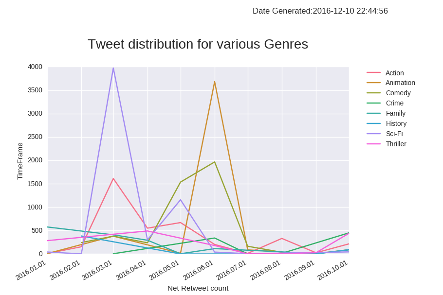

# INFO 7374 - Emotion Analysis with imdb, temperature and twitter data

# Introduction

<table width="100%">
<tr>
<td></td>
<td><p align="center"></td>
<td align="right"><td>
</tr>

The Analysis done is to assess the mindset of people living in a particular location by combining the imdb ratings information, movie awards won information, tweets that people make and the weather data. Our results indeed prove that there is positive correlation between type of movies people prefer and weather of a particular location. Ex: US prefers animation movies the most in Summer.

# Data Collection

Data collected from three different sources:
    - IMDB Database(API)
    - Twitter Data(API)
    - Temperature Data(ZIP-CSV)

# Step-1 Data Collection:

# 1. Read_imdb  Calling syntax: - python read_imdb.py --sd 2012 --ed 2013

I/P:

--sd start year

--ed end year

Pre-req: title.csv file that has list of all inputs

O/P-1: Under Movies folder, automatic creation of subfolders with syntax 'Movies_<sd>_<ed>_yyyymmdd' 

O/P-2: Under every created folder, clean json file for every movie will be fetched by passing movie title from title.csv file --> Stored as <imdbid>_<ReleaseYear>.json

# 2.process_imdb_csv calling syntax python process_imdb_csv.py

I/P: No Input parameters

O/P: Process_movie.csv - csv version of json files generated in earlier step

# 3.read_movie_tweets calling syntax python read_movie_tweets.py --c 200 --y 2016

I/P: Number of tweets to be fetched per movie using --c and movie released in a particular year using --y

Processing: This internally calls read_tweets.py --i imdbid --s searchterm --movie --c count

 - Since we have limits in fetching tweets. Only "--c" tweets in every genre will be fetched for a given year.
 - Fetched raw tweets for every movie is saved in tweets folder under tweets/<Searchmovietitle>/<yyyymmdd>/<imdb-id>_<search-movie-title>_<yyyymmdd>_<hhmiss>.json
 - Processed individual tweets are saved in Processed_tweets/<imdbid>_<Searchmovietitle>_<yyyymmdd>_<hhmiss>.json

# 4.process_tweets calling syntax python process_tweets.py

I/P: No Input parameters

O/P: Process_tweets.csv - csv version of json files generated in earlier step

# 5.weather (Src:https://www.ncdc.noaa.gov/orders/qclcd/):

python unzip_files.py

O/P: unzipped version - Only saves Station and monthly weather details in their respective folders

python combinecsv.py (Also converts '|' separation in station files to csv)

O/P: Combines multiple csvs created for station and weather-monthly, eliminating csv headers and save them as 'weather_monthly.csv' and 'weather_station.csv' respectively

python weather_state_yrmonth

O/P: Joins on WBAN (Station-code) and produces a single file for processing

# Step-2 Data Processing:

# 1.Geographic Genre Distribution calling syntax python analysis1_csv_geo_year_genredist.py

Step-1: Create Separate Genre file (Genres are ';' separated). Genre.csv has imdbID and Genre in it

Step-2: Create Separate Country file (Countryes are ';' separated). Country.csv has imdbID and Country in it

Step-3: Calculate imdbNetRating: imdBnetRating = imdBRating * imdBvotes

Step-4: Join Movie, Genre and Country on imdbID

Step-5: Calculate Arithmetic mean for imdBnetRating on (Country,Genre,Released) combinatin

Step-6: write to Geo_year_genredist.csv

# 2.Genre Distribution with respect to retweet+favorite count over years calling syntax python analysis2_csv_tweets_genre_yrmonth.py

Step-1: Calculate Famous_Count=Retweetcount+Favoritecount for every record

Step-2: Join tweet and tweet_created_year on imdb id

Step-3: Calculate arithmetic Mean of Famous_count on (Genre, Released Year, Released Month) combination

Step-4: write to tweets_genre_yrmonth.csv

# 3.Correlation between temperature and rating calling syntax python analysis3_csv_temp_genre_netrating.py

Step-1: Separate all Released date info to Date, Year, Month using pd.to_datetime()

Step-2: Compute National level monthly temperature dist

Step-3: Join temperature data with movie data on Month, Year combination

Step-4: Compute average(imdbNetrating) at (Genre,temperature) level

Step-5: write to temp_genre_netrating.csv

# 4.Genre wise performance of a director python analysis4_dir_genre_netrating.py

Step-1: Create Director Genre file (Directors are ';' separated). Director.csv has imdbID and Director in it

Step-2: Join Director file with movie file on imdbID

Step-3: Compute average(imdbNetrating) at (Genre,Director) level

Step-4: write to dir_genre_netrating.csv 

# 5.Distribution of awards by language and genre: python analysis5_csv_lang_genre_awards.py

Step-1: Compute Awards_won and Awards_nominated using  Awards field in Movies (NLP convept)

Step-2: Create Language file (Languages are ';' separated). Language.csv has imdbID and Language in it

Step-3: Join Language file with movie file on imdbID

Step-4 Aggregate Awards_won at Genre and language level

Step-5: Write to lang_genre_awards.csv

# Step-3 Data Analysis:

# 1.Genre wise performance of a director python analysis4_dir_genre_netrating.py

Following analysis shows the genre, a particular movie director is good at. The code takes Director as input and internally computes the ratings and provides us a bar plot that clearly shows the type of movie that a director is good at.


# 2.Correlation between temperature and rating calling syntax python analysis3_csv_temp_genre_netrating.py

Following analysis helps us to see the correlation between net imdb rating (imdbrating * number of votes) against weather in a particular area. Notice, that Action movies has negative correlation with temperature while Animation movies has positive correlation with temperature. In other words, people prefer action movies the least in summer and they prefer animation the most in summer.


# 3.Genre Distribution with respect to Net tweet count over years

Following analysis helps us to visualize the tweet count distribution for a particular genre over few years. This further confirms the results receieved from Analysis-2 as we notice, Animation movies are most tweeted among the list of movies in Summer.



# 4. Geographic distribution of genre with respect to time

Following analysis helps us to understand the geographic distribution of genre preference for a country aross years.


# 5. Language wise Award distribution

Following analysis helps us to analyse the best performing genres across foreign language movies.


```python

```
